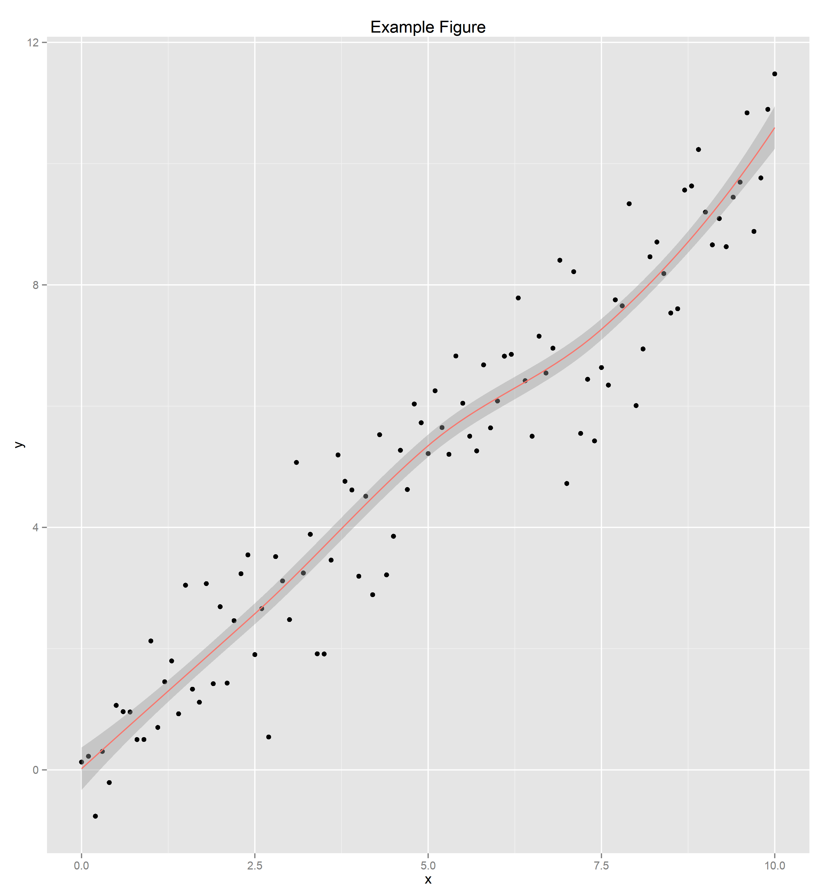

Markdown test
=============
Some normal text.

```bash
echo Hello world!
```

```
# Hello world!
```

```bash
ls -p
```

```
# example/
# README.md
# shelldoc.py
```


Code blocks in other programming languages can be included as well, but the
code will not be evaluated by shelldoc.

```r
#
# This code will not be evaluated by shelldoc, but can be included for
# illustrative purposes. Check out knitr if you want to generate reports
# for R code.
#
library(locfit)
library(ggplot2)

x = seq(0,10, by=0.1)
y = x + rnorm(101)
df = data.frame(x=x, y=y)

p = qplot(x, y)
p + geom_smooth(aes(x,y), data=z, method="locfit", color='#F8766D') + 
    ggtitle("Example Figure")
ggsave("example.png")
```

Figures can also be embedded by specifying the location where the figure
can be found.



